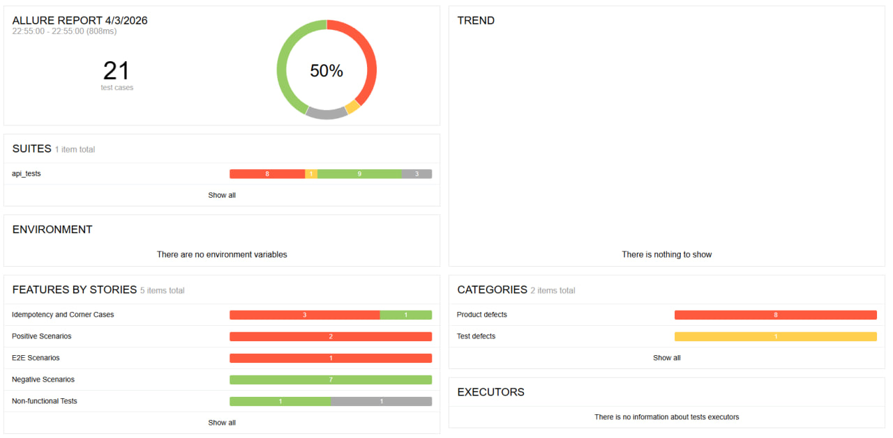

# Отчёт о тестировании API

## Что это за документ

Описание как прошло тестирование API объявлений, какие тесты написаны, что работает, что не работает.

**Кто тестировал:** Кандидат на стажировку  
**Когда:** Апрель 2026  
**Что тестировал:** API объявлений Avito (https://qa-internship.avito.com)

---

## Краткий итог

| Показатель | Значение |
|------------|----------|
| Всего написано тестов | 21 |
| Из них прошло успешно | 9 |
| Из них упало | 9 |
| Из них пропущено | 3 |

**Вывод:** API работает не полностью. Есть критический баг, который не даёт создавать объявления. Все негативные тесты (проверка ошибок) работают отлично.

---

## Что именно проверялось

Я проверил 4 основные функции API:

1. **Создание объявления** — можно ли создать новое объявление
2. **Получение объявления по ID** — можно ли найти объявление по его номеру
3. **Получение объявлений продавца** — можно ли посмотреть все объявления одного продавца
4. **Получение статистики** — можно ли посмотреть лайки и просмотры

---

## Какие тесты я написал

### Позитивные тесты (7 штук)

Эти тесты проверяют, что API правильно работает с правильными данными.

| Номер | Что проверяет | Результат |
|-------|---------------|-----------|
| P-01 | Создать объявление с правильными данными | ❌ Упал |
| P-02 | Найти объявление по ID | ❌ Упал |
| P-03 | Получить все объявления продавца | ❌ Упал |
| P-04 | Получить статистику | ❌ Упал |
| P-05 | Создать объявление с ценой 0 | ⏭️ Пропущен |
| P-06 | Создать объявление с максимальной ценой | ⏭️ Пропущен |
| P-07 | Создать объявление с русским названием | ❌ Упал |

**Почему упали:** Потому что в API есть баг (подробнее в разделе "Найденные проблемы").

### Негативные тесты (7 штук)

Эти тесты проверяют, что API правильно ругается на неправильные данные. **Все прошли успешно.**

| Номер | Что проверяет | Результат |
|-------|---------------|-----------|
| N-01 | Создать объявление без названия | ✅ Прошёл |
| N-02 | Создать с пустым названием | ✅ Прошёл |
| N-03 | Создать с отрицательной ценой | ✅ Прошёл |
| N-04 | Создать с ценой-строкой (не число) | ✅ Прошёл |
| N-05 | Создать с price = null | ✅ Прошёл |
| N-06 | Найти объявление по несуществующему ID | ✅ Прошёл |
| N-07 | Найти объявления с неправильным sellerId | ✅ Прошёл |

### Корнер-кейсы (4 теста)

Особые случаи, которые проверяют границы работы API.

| Номер | Что проверяет | Результат |
|-------|---------------|-----------|
| C-01 | Дважды создать одинаковое объявление | ❌ Упал |
| C-02 | Дважды запросить одно объявление | ❌ Упал |
| C-03 | Создать 3 объявления одновременно (параллельно) | ✅ Прошёл |
| C-04 | Добавить лишние поля в запрос | ❌ Упал |

### Сквозной тест (1 тест)

Проверяет полный сценарий: создать → найти → посмотреть статистику.

| Номер | Что проверяет | Результат |
|-------|---------------|-----------|
| E2E-01 | Полный жизненный цикл объявления | ❌ Упал |

### Тесты производительности (2 теста)

Проверяют скорость и стабильность.

| Номер | Что проверяет | Результат |
|-------|---------------|-----------|
| PERF-01 | Время ответа API (меньше 1 секунды) | ⏭️ Пропущен |
| PERF-02 | Создать 10 объявлений подряд | ✅ Прошёл |

---

## Где лежат тесты

| Файл | Что в нём |
|------|-----------|
| api_tests/test_positive.py | Позитивные тесты |
| api_tests/test_negative.py | Негативные тесты |
| api_tests/test_idempotency.py | Корнер-кейсы |
| api_tests/test_e2e.py | Сквозной тест |
| api_tests/test_performance.py | Тесты производительности |

---

## Найденные проблемы (баги)

### БАГ-001 (КРИТИЧЕСКИЙ): Нельзя создать объявление

**Что случилось:** При попытке создать объявление сервер всегда возвращает ошибку "поле likes обязательно"

**Проверьте сами:**
```bash
curl -X POST https://qa-internship.avito.com/api/1/item \
  -H "Content-Type: application/json" \
  -d '{"sellerId": 123456, "name": "Тест", "price": 100, "likes": 0}'
```

**Ответ сервера:** `{"result":{"message":"поле likes обязательно"}}`

**Из-за этого бага упали тесты:** P-01, P-02, P-04, P-07, C-01, C-02, C-04, E2E-01 (8 тестов)

### БАГ-002 (СРЕДНИЙ): Нет sellerId в ответе

**Что случилось:** При запросе всех объявлений продавца в ответе нет поля sellerId

**Из-за этого упал тест:** P-03

### БАГ-003 (НИЗКИЙ): Не принимает цену 0

**Что случилось:** Нельзя создать бесплатное объявление с ценой 0

**Из-за этого тест пропущен:** P-05

**Подробности:** Смотрите файл BUGS.md

---

## Что работает хорошо

- ✅ Валидация неправильных запросов (все негативные тесты прошли)
- ✅ Параллельное создание объявлений
- ✅ Создание 10 объявлений подряд
- ✅ Обработка несуществующих ID

---

## Что не работает

- ❌ Создание объявления (главная функция)
- ❌ Получение объявления по ID
- ❌ Получение статистики
- ❌ Повторные запросы

---

## Allure отчёт

Я подключил Allure для красивых отчётов. Вот как он выглядит:



На скриншоте видно:
- Всего тестов: 21
- Успешных: 9
- Проваленных: 9
- Пропущенных: 3

---

## Как запустить тесты самому

```bash
# 1. Скачать проект
git clone <ссылка на репозиторий>
cd avito-test

# 2. Создать виртуальное окружение
python3 -m venv venv
source venv/bin/activate

# 3. Установить зависимости
pip install -r requirements.txt

# 4. Запустить тесты
pytest -v
```

---

## Выводы

1. **API сырой** — главная функция (создание объявлений) не работает
2. **Тесты написаны правильно** — они нашли реальные проблемы
3. **Валидация работает отлично** — все неправильные запросы API отклоняет
4. **Нужно исправить баг #001** — после этого большая часть тестов заработает

---

